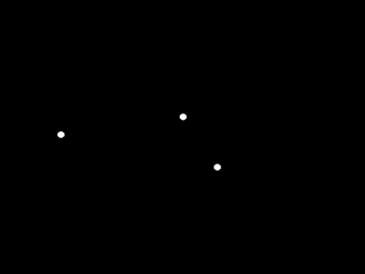

[](https://travis-ci.org/Mandarancio/nbodies)
# nbodies

Siple N Body simulation in Haskell (rendered using SDL2)

**Have fun ;)**



## Setup and run

```bash
stack build
stack exec nbodies config/cfg.yml
```

## Configuration
The configuration is a Yaml file and has this structure:

```yaml
--- # Configuration
g: 1                       # universal gravitational constant
dT: 0.2                    # time interval of the simulation
bodies:                    # list of bodies
  - pos: {x:   0., y: 0.}  # position
    mass: 100.             # mass
    mom: {x:   0., y: 0.}  # momentum (speed)
```